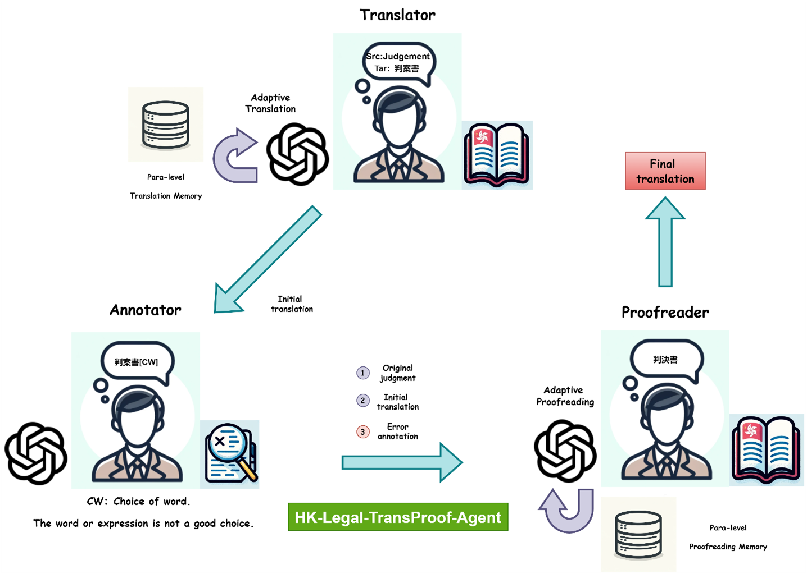

# TAP MAS: Translation and Proofreading System for Hong Kong Legal Judgments

  
  *Figure 1: TAP MAS: a Multi-Agent System for Translating and Proofreading Hong Kong Legal Judgments*

  We have established a virtual professional studio of MAS as the underlying MT engine to support the HMIT platform for Hong Kong legal judgment translation and proofreading. Its overall architecture is given in Figure 1. The roles of its three agents are Translator, Annotator, and Proofreader. Following these typical roles in translation, we call it TAP MAS, or simply TAP. This model simulates the entire translation process of a judgment (or any text), with these agents in different roles co-working together to ensure the quality and consistency of the final product throughout the whole translation process.
  
  The system is about to be launched and published at [https://hmit.LT.cityu.edu.hk](https://hmit.LT.cityu.edu.hk).

