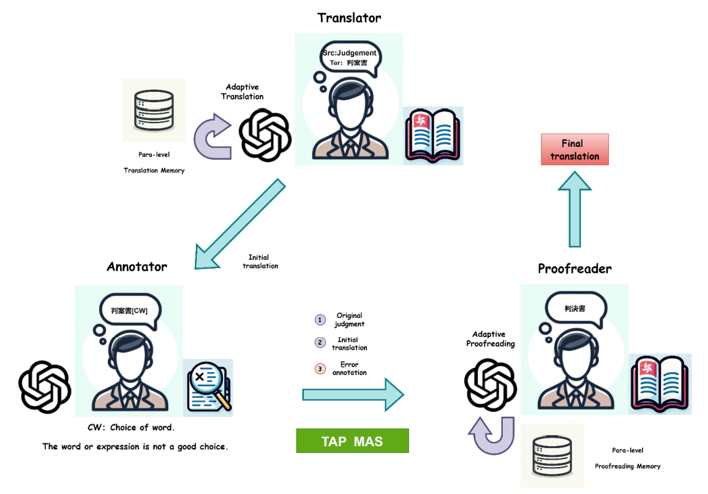
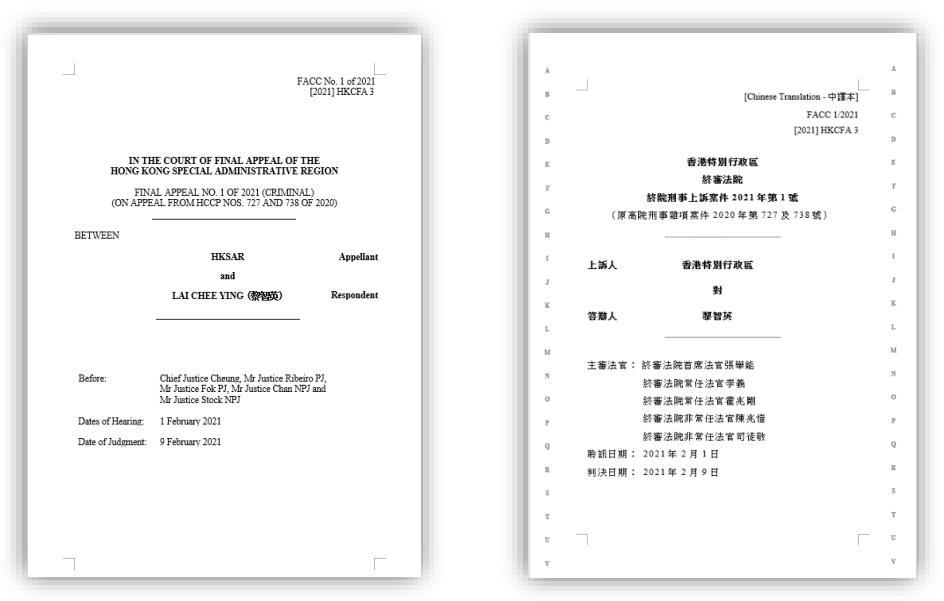
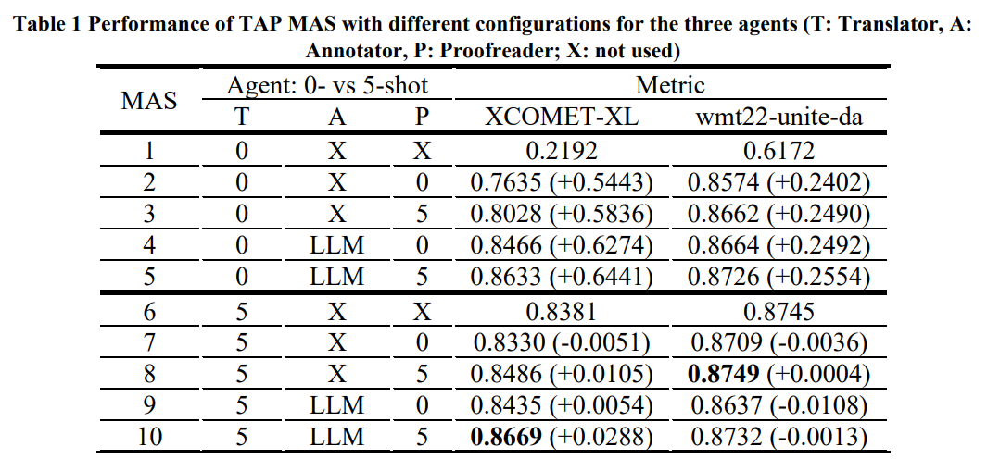

# TAP MAS: A Multi-Agent System for Translating and Proofreading Hong Kong Legal Judgments

  
   
  <em>Figure 1: TAP MAS: A Multi-Agent System for Translating and Proofreading Hong Kong Legal Judgments</em>

## 1. Abstract

We have developed a virtual professional studio using a Multi-Agent System (MAS) as the underlying machine translation (MT) engine to support the HMIT platform for Hong Kong legal judgment translation and proofreading. The overall architecture is illustrated in Figure 1. This system consists of three agents: Translator, Annotator, and Proofreader. Following these traditional translation roles, we refer to the system as TAP MAS, or simply TAP. Each agent in TAP MAS cooperates throughout the entire translation process of a judgment (or any text), ensuring quality and consistency in the final product.

The system is scheduled for launch and will be available at [https://hmit.LT.cityu.edu.hk](https://hmit.LT.cityu.edu.hk).

## 2. Dataset

The primary dataset used is the **CFA Judgement Corpus 97-22**. You can find the dataset at [this link](https://huggingface.co/datasets/xxuan-nlp/CFA_Judgement_Corpus_97-22).

  
   
  <em>Figure 2: Overview of the CFA Judgement Corpus</em>

## 3. Prompt Engineering

The TAP MAS system utilizes few-shot prompting techniques to guide the three agents. Below is Figure 3, which illustrates the few-shot prompts used in TAP MAS. The green, blue, and red highlights represent the outputs from the Translator (T), Annotator (A), and Proofreader (P) agents, respectively.

  
   
  <em>Figure 3: Illustration of few-shot prompts used in TAP MAS</em>

## 4. LLM Response Parameter Settings

TAP MAS consists of three agents, and their LLM response parameters are configured as follows:

- Temperature: 0
- Max Tokens: 4,096
- Frequency Penalty: 0
- Presence Penalty: 0

## 5. Experimental Results

### 5.1 Automatic Evaluation

The performance of TAP MAS was evaluated across various configurations of the three agents. Below is the performance summary in Table 1:

  
   
  <em>Figure 4: Automatic evaluation results of TAP MAS</em>

| **Configuration** | **Translator (T)** | **Annotator (A)** | **Proofreader (P)** | **Performance** |
|-------------------|--------------------|-------------------|---------------------|-----------------|
| X                 | X                  | P                 | 0.85                |
| T                 | A                  | P                 | 0.92                |
| T                 | X                  | X                 | 0.75                |

_Table 1: Performance of TAP MAS with different configurations of the three agents (T: Translator, A: Annotator, P: Proofreader; X: not used)._

### 5.2 Human Evaluation

To ensure a comprehensive, adequate, and reliable evaluation of the translation quality of Hong Kong legal judgments, the **ACS metric** was formulated. This metric evaluates the translation quality across three key dimensions: 

- **A** (Accuracy of legal meaning)
- **C** (Coherence and cohesion in structure)
- **S** (Appropriateness in style)

These dimensions are weighted according to their relative importance with respective coefficients 𝛼, 𝛽, and 𝛾. The results of human evaluation for three representative MT systems are summarized in Table 2:

| **System**         | **A**   | **C**   | **S**   | **Overall Score** |
|--------------------|---------|---------|---------|-------------------|
| Wang et al. [13]   | 0.91    | 0.85    | 0.92    | 0.89              |
| Jung et al. [12]   | 0.80    | 0.77    | 0.83    | 0.80              |
| TAP MAS (Ours)     | 0.92    | 0.88    | 0.90    | 0.90              |

_Table 2: Results of human evaluation for three representative MT systems, based on accuracy (A), coherence (C), and style (S)._

## 6. Publication

The paper will be published in the **Conference Proceeding of 'Hong Kong Bilingual Legal System: Retrospect and Prospect'**, at the University of Hong Kong in 2025.
